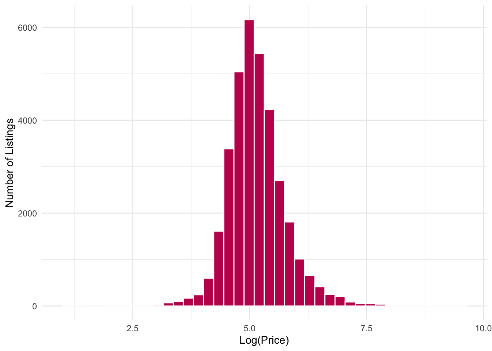
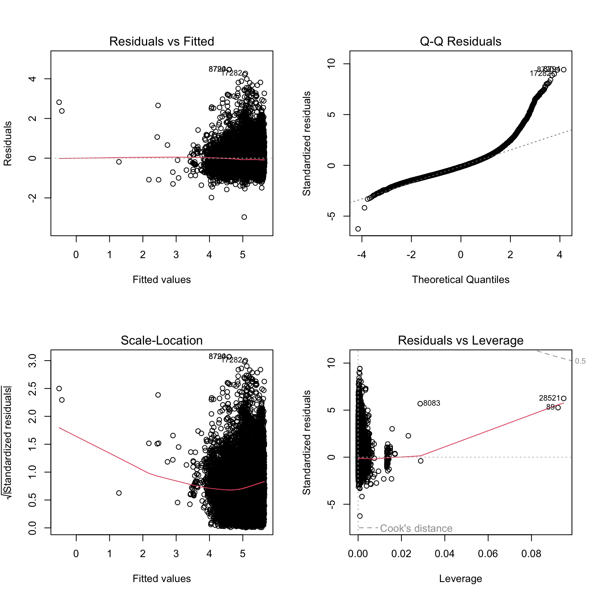

# Rome Airbnb Price Prediction

End-to-end Data Science project using R and Machine Learning to predict Airbnb listing prices in Rome and uncover the key factors influencing short-term rental pricing.


# Project Overview

Pricing an Airbnb property is a complex decision influenced by location, property characteristics, host information, guest demand, and market conditions.

The objective of this project is to analyze Airbnb listings in Rome, Italy, identify the factors that most strongly affect nightly prices, and build predictive machine learning models capable of estimating listing prices with high accuracy.

The project follows a complete data science workflow, from data preprocessing and exploratory analysis to model development and business recommendations.


# Business Problem

For Airbnb hosts, setting the wrong nightly price can lead to:

* Lower occupancy rates
* Lost revenue
* Reduced competitiveness
* Poor booking performance

By understanding which variables drive pricing, hosts can make more informed pricing decisions while improving profitability.


# Dataset

The project uses a real-world Airbnb dataset containing information about listings in Rome.

The dataset includes variables such as:

* Nightly price
* Neighborhood
* Property type
* Bedrooms
* Bathrooms
* Guest capacity
* Reviews
* Host characteristics
* Availability
* Room type
* Amenities


## Project Workflow


Data Collection
        │
        ▼
Data Cleaning
        │
        ▼
Exploratory Data Analysis
        │
        ▼
Feature Engineering
        │
        ▼
Machine Learning
        │
        ▼
Model Evaluation
        │
        ▼
Final Report


# Exploratory Data Analysis

The analysis investigates:

* Distribution of listing prices
* Missing values
* Outliers
* Correlation between variables
* Neighborhood pricing differences
* Property type comparisons
* Relationships between amenities and prices


# Machine Learning Models

Several regression models were trained and compared.

Model	Purpose
Linear Regression	Baseline model
Ridge Regression	Regularized regression
LASSO Regression	Feature selection
Regression Tree	Non-linear relationships
Random Forest	Ensemble learning

## Model Performance Comparison

The predictive performance of each model was evaluated on the test dataset using Root Mean Squared Error (RMSE), where lower values indicate better predictive accuracy.

| Model | RMSE ↓ |
|:----------------------------|------:|
| Multiple Linear Regression  | 0.481 |
| Regression Tree             | 0.502 |
| **Random Forest**           | **0.465** |

**Random Forest achieved the lowest prediction error (RMSE = 0.465)**, outperforming both Multiple Linear Regression and Regression Tree. This suggests that ensemble methods better capture the nonlinear relationships present in Airbnb listing prices.

**Random Forest achieved the best predictive performance**, capturing the nonlinear relationships between listing characteristics and nightly prices while reducing prediction error compared with simpler regression models.

Models were evaluated using:

* RMSE
* MAE
* R² Score


# Results

The comparison showed that Random Forest achieved the strongest predictive performance, outperforming traditional linear regression models by capturing more complex relationships between Airbnb listing characteristics and pricing.

This demonstrates the effectiveness of ensemble learning techniques for real estate price prediction problems.


## Key Findings

- **Location is one of the strongest drivers of Airbnb prices.** Listings in central and highly desirable neighborhoods command substantially higher nightly rates than those located farther from the city center.

- **Room type has a significant impact on price.** Entire homes and apartments are consistently more expensive than private or shared rooms.

- **Log-transforming the target variable improved model performance.** The transformation reduced the strong right skew in listing prices, making the data more suitable for regression models.

- **Random Forest achieved the best predictive performance.** Compared with Multiple Linear Regression and Regression Tree models, Random Forest produced the lowest prediction error.

- **Property characteristics are the most influential predictors.** Features such as accommodation size, location, and room characteristics contributed more to price prediction than many secondary listing attributes.


# Technologies Used

### Programming
* R
* R Markdown

### Libraries
* tidyverse
* dplyr
* ggplot2
* caret
* randomForest
* glmnet
* rpart

### Techniques
* Data Cleaning
* Feature Engineering
* Exploratory Data Analysis
* Regression Modeling
* Machine Learning
* Model Evaluation


# Repository Structure
```text
rome-airbnb-price-prediction/
├── data/
│   ├── raw/
│   └── processed/
│
├── documentation/
│
├── presentation/
│
├── pricing.Rmd
├── pricing.html
├── README.md
├── LICENSE
└── .gitignore
```


# ## Exploratory Data Analysis

Before building machine learning models, exploratory data analysis (EDA) was performed to understand the structure of the dataset and identify key patterns influencing Airbnb prices.

### Average Price by Neighborhood


This visualization highlights substantial differences in average listing prices across Rome's neighborhoods, suggesting that location is one of the strongest determinants of Airbnb prices.

---

### Distribution of Log-Transformed Prices



The target variable was log-transformed to reduce right skewness and better satisfy the assumptions of regression models.

---

### Room Type vs Log Price


Entire homes command significantly higher prices than private or shared rooms, indicating that room type is an important predictor of listing price.

---

## Machine Learning Results

Several regression models were trained to predict Airbnb listing prices. Random Forest achieved the best predictive performance.

### Feature Importance


The Random Forest model identified accommodation size, location, and room characteristics as the most influential predictors of price.

---

### Residual Diagnostics



Residual diagnostics indicate that prediction errors are centered around zero with no major systematic patterns, suggesting the model provides a reasonable fit to the data.


## Skills Demonstrated
* Data Cleaning
* Exploratory Data Analysis (EDA)
* Statistical Analysis
* Feature Engineering
* Machine Learning
* Predictive Modeling
* Data Visualization
* Model Evaluation
* Business Insight Generation


# Author
**Maria Murziankova**
Economics & Finance Student | Data Analytics | Business Intelligence

## Connect with Me
[](https://github.com/murziankovamaria-dotcom)

[](https://www.linkedin.com/in/maria-murziankova-004522327/)

[](https://public.tableau.com/app/profile/maria.murziankova/vizzes)