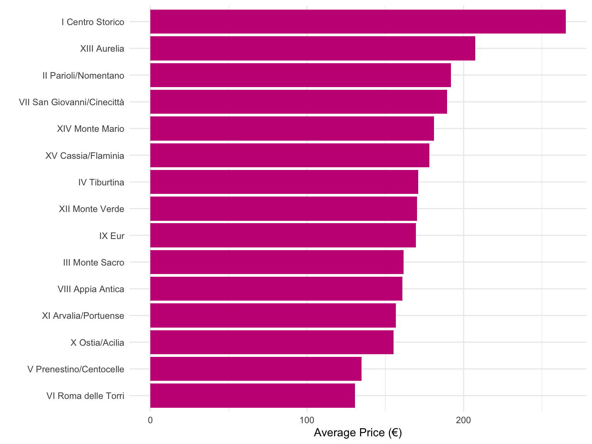
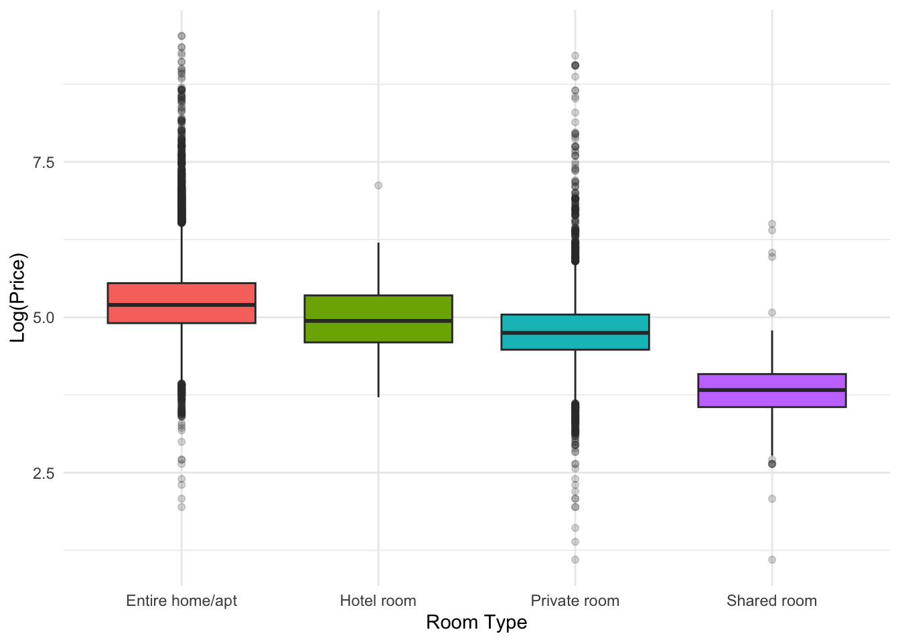
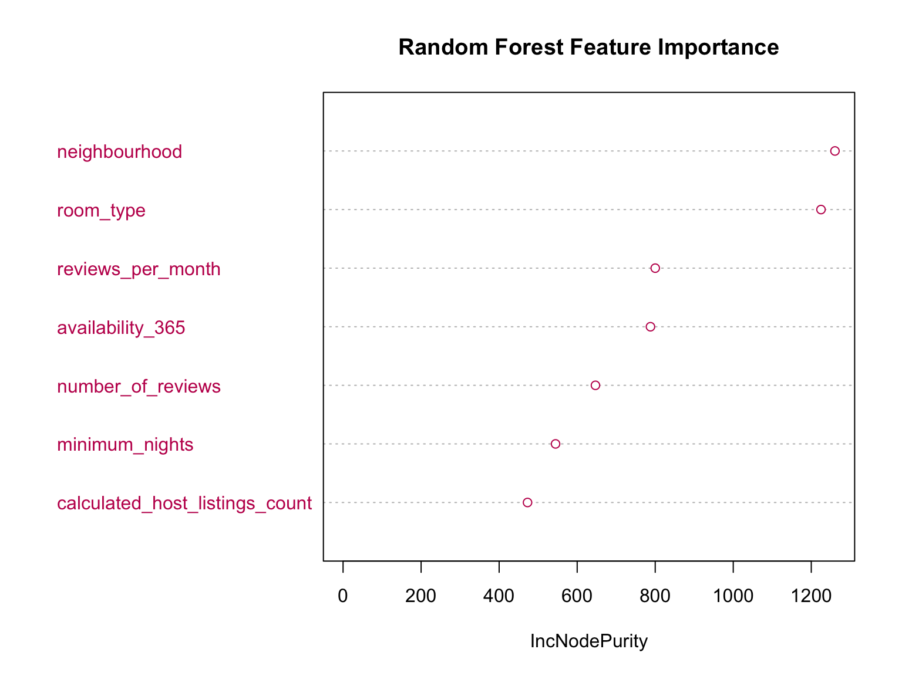

Rome Airbnb Price Prediction

End-to-end Data Science project using R and Machine Learning to predict Airbnb listing prices in Rome and uncover the key factors influencing short-term rental pricing.

⸻

Project Overview

Pricing an Airbnb property is a complex decision influenced by location, property characteristics, host information, guest demand, and market conditions.

The objective of this project is to analyze Airbnb listings in Rome, Italy, identify the factors that most strongly affect nightly prices, and build predictive machine learning models capable of estimating listing prices with high accuracy.

The project follows a complete data science workflow, from data preprocessing and exploratory analysis to model development and business recommendations.

⸻

Business Problem

For Airbnb hosts, setting the wrong nightly price can lead to:

* Lower occupancy rates
* Lost revenue
* Reduced competitiveness
* Poor booking performance

By understanding which variables drive pricing, hosts can make more informed pricing decisions while improving profitability.

⸻

Dataset

The project uses a real-world Airbnb dataset containing information about listings in Rome.

The dataset includes variables such as:

* Nightly price
* Neighborhood
* Property type
* Bedrooms
* Bathrooms
* Guest capacity
* Reviews
* Host characteristics
* Availability
* Room type
* Amenities

⸻

Project Workflow

Raw Airbnb Data
        │
        ▼
Data Cleaning
        │
        ▼
Exploratory Data Analysis
        │
        ▼
Feature Engineering
        │
        ▼
Statistical Analysis
        │
        ▼
Machine Learning Models
        │
        ▼
Model Evaluation
        │
        ▼
Business Insights

⸻

Exploratory Data Analysis

The analysis investigates:

* Distribution of listing prices
* Missing values
* Outliers
* Correlation between variables
* Neighborhood pricing differences
* Property type comparisons
* Relationships between amenities and prices

⸻

Machine Learning Models

Several regression models were trained and compared.

Model	Purpose
Linear Regression	Baseline model
Ridge Regression	Regularized regression
LASSO Regression	Feature selection
Regression Tree	Non-linear relationships
Random Forest	Ensemble learning

Models were evaluated using:

* RMSE
* MAE
* R² Score

⸻

Results

The comparison showed that Random Forest achieved the strongest predictive performance, outperforming traditional linear regression models by capturing more complex relationships between Airbnb listing characteristics and pricing.

This demonstrates the effectiveness of ensemble learning techniques for real estate price prediction problems.

⸻

💡 Key Insights

Some important findings include:

* Location is one of the strongest determinants of price.
* Entire homes command significantly higher prices than private rooms.
* Larger properties generally have higher nightly rates.
* Listing characteristics and amenities substantially influence pricing.
* Ensemble machine learning models outperform simple linear approaches.

⸻

🛠 Technologies Used

Programming

* R
* R Markdown

Libraries

* tidyverse
* dplyr
* ggplot2
* caret
* randomForest
* glmnet
* rpart

Techniques

* Data Cleaning
* Feature Engineering
* Exploratory Data Analysis
* Regression Modeling
* Machine Learning
* Model Evaluation

⸻

Repository Structure

rome-airbnb-price-prediction/
├── data/
│   ├── raw/
│   └── processed/
│
├── documentation/
│
├── presentation/
│
├── pricing.Rmd
├── pricing.html
├── README.md
├── LICENSE
└── .gitignore

⸻

Project Preview

### Average Airbnb Price by Neighborhood

Average nightly Airbnb prices vary considerably across Rome's neighborhoods. Historic and central districts command the highest prices, reflecting stronger tourist demand and premium locations.

  

### Distribution of Log-Transformed Prices

The original price distribution is highly right-skewed. Applying a logarithmic transformation produces a more symmetric distribution, making the data better suited for regression modeling.

  

### Room Type vs Log-Transformed Nightly Price

Entire homes consistently achieve the highest nightly prices, while shared rooms represent the lowest-priced segment. Displaying log-transformed prices reduces the influence of extreme outliers and highlights differences between room types more clearly.

  

### Random Forest Feature Importance

The Random Forest model ranks predictors according to their contribution to predicting Airbnb listing prices. Neighbourhood and room type emerge as the most influential features, followed by booking activity and host characteristics.

  

### Residual Diagnostics

Residual diagnostic plots were used to evaluate the regression model assumptions and identify potential outliers, influential observations, and patterns in prediction errors.

  

⸻

How to Run

Clone the repository

git clone https://github.com/murziankovamaria-dotcom/rome-airbnb-price-prediction.git

Open the project in RStudio.

Install the required packages.

install.packages(c(
  "tidyverse",
  "caret",
  "randomForest",
  "glmnet",
  "rpart",
  "ggplot2"
))

Run the R Markdown file to reproduce the complete analysis.

⸻

🎓 Skills Demonstrated

* Data Cleaning
* Exploratory Data Analysis (EDA)
* Statistical Analysis
* Feature Engineering
* Machine Learning
* Predictive Modeling
* Data Visualization
* Model Evaluation
* Business Insight Generation

⸻

# Author

**Maria Murziankova**
Economics & Finance Student | Data Analytics | Business Intelligence

## Connect with Me

